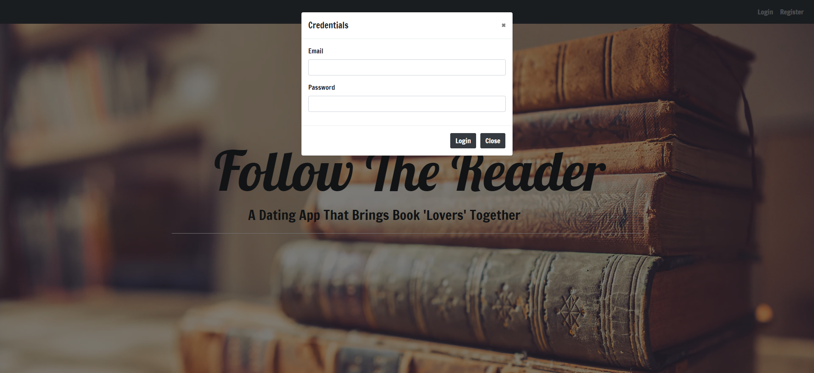
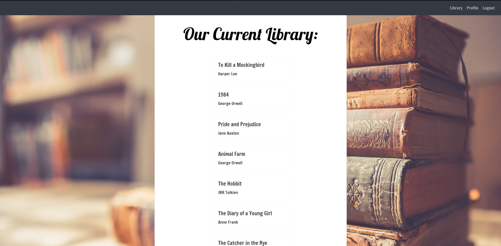

[](https://travis-ci.com/alperg/project2-starter-auth)

# Project 2 - Follow the Reader
```
Are you a book lover looking for someone to discuss your latest read with? Maybe you would like to meet new people with who are interested in the same genere? Or are you just looking for new books to read?

Follow the Reader is the newest app on the market that allows the user to meet new people and share a love of books using our app. This app allows the users to looks for other users who have similar tastes in books as well as searching a data base for new books!
```
## Live Link:

* [Follow the Reader](https://follow-the-reader.herokuapp.com/)

* [Github Repository](https://github.com/AnneliseRowan/project-2)

* [PowerPoint Presentation](https://docs.google.com/presentation/d/1cCmq_xqrjPoKTD3H3EaZNihGRk11GQxBi69MR3LyOp4/edit?usp=sharing)

## User Stories

* As a user, I want to view the books within the library database.

* As a user, I want to search for books within the library database.

* As a user, I want to view suggested users based on books that are in my library.

* As a user, I want to contact those suggested users.

* As a user, I want to view other user's profiles.

## DEMO

### This is the landing page of Follow the Reader, before you login.


### This is the login modal that will popup when you click login



### Once you login, your navigation bar gives you access to other parts of the site including the books library and user profile


### You can browse the extensive library of books on our app under the books tab



### The user profile page presents with a picture, email, followers, and suggested users based on similar books in your individual libraries


### A list of cards generates for all books the user has read


### A separate list of cards generates for the books the user is currently reading


### The update profile section is at the bottom of the user's profile


## Technology Used

```
Sequelize

MySql

Node.js

Express.js

Handlebars.js

Heroku

Autocomplete.js

```


## Contributors:

* [James Antley](https://github.com/Jimmant91)

* [Rachael Davis](https://github.com/themetalsaint)

* [Alexis Ligon](https://github.com/alexisligon)

* [Jonathan Nance](https://github.com/speakeasyman)

* [Annélise Rowan](https://github.com/AnneliseRowan)

* [Naomi Valdovinos](https://github.com/Nvaldovinos)
